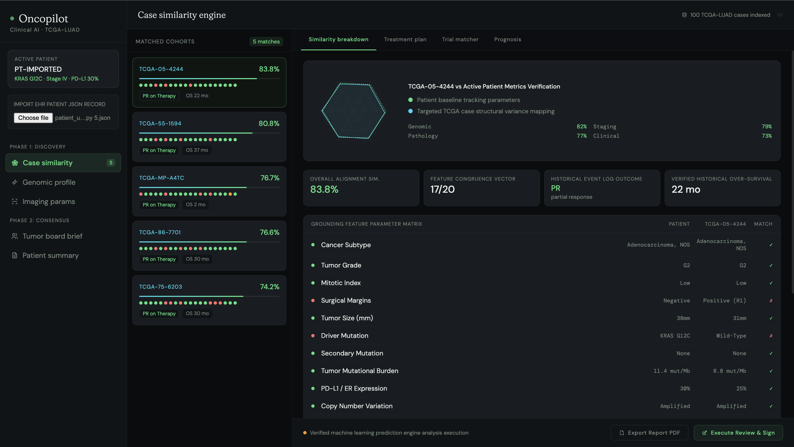
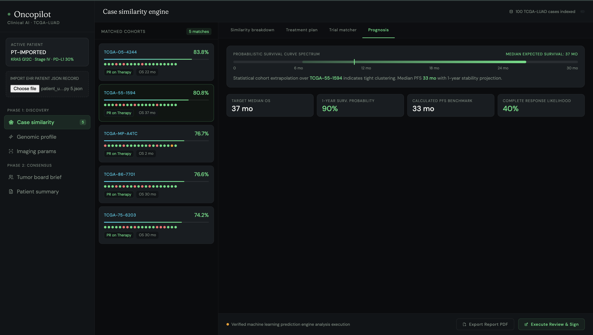

# Oncopilot

**Clinical decision support for oncology — case similarity, treatment rationale, and tumor board prep in one workspace.**

Oncopilot is a hackathon MVP that matches an imported patient record against a historical cohort (TCGA-LUAD), scores similarity across pathology, genomics, imaging, and clinical parameters, and generates AI-assisted treatment rationale, trial matches, prognosis estimates, and clinician-facing documentation.

<p>
  
  
</p>

## Overview

An oncologist imports a patient's EHR record as JSON. Oncopilot runs a weighted similarity search against a local TCGA case database, surfaces the top 5 historically matched cases, and builds out a full clinical workspace around the best match — including a genomic profile view, radiomics/imaging panel, treatment plan with AI-generated rationale, clinical trial matcher, prognosis curve, tumor board brief, and a SOAP note draft.

Every recommendation is grounded in the matched case's actual documented outcome and guideline citation rather than a generic model response — the AI rationale layer is explicitly prompted against the specific matched patient's data.

## Features

- **EHR JSON import** — single-file patient record upload, no manual data entry
- **Multi-modal similarity engine** — weighted scoring across 4 domains (pathology, genomics, imaging, clinical), 20 parameters total
- **Case similarity dashboard** — top-5 matched TCGA cases with per-parameter match/mismatch breakdown and radar visualization
- **Genomic profile view** — driver/secondary mutation table, TMB percentile, PD-L1 expression, CNV status, locus mapping
- **Imaging / radiomics panel** — simulated DICOM slice viewer, tumor diameter, density, sphericity, necrotic core ratio
- **Treatment plan module** — evidence-tagged drug recommendations cross-referenced against NCCN guidelines
- **AI clinical rationale** — Claude-generated explanation of why the matched case is relevant and why the recommended regimen fits, grounded in the specific patient's mutation profile
- **Clinical trial matcher** — eligibility status against live trial criteria
- **Prognosis module** — survival curve range, median OS/PFS, 1-year survival probability, complete response likelihood
- **Tumor board brief generator** — auto-drafted case synopsis for presentation
- **SOAP note builder** — clipboard-ready chart documentation draft
- **Empty-state guardrails** — no data is fabricated or shown before a real patient record is loaded

## Architecture

```
Patient EHR JSON (import)
        ↓
HTML/CSS/JS Frontend (Oncopilot terminal UI)
        ↓  POST /api/match
FastAPI Backend (Python, port 8001)
        ├── Normalization layer (smoking status, margin status, etc.)
        ├── Categorical / Numerical / Array scoring functions
        ├── Weighted domain aggregation
        │     (pathology 25% · genomics 25% · imaging 25% · clinical 25%)
        └── TCGA-LUAD case database (data/tcga_cases_LUAD.json)
        ↓
Top-5 Ranked Matches + Parameter Matrix
        ↓
        ├── Case Similarity view (radar + stats + param table)
        ├── Treatment Plan view  → POST /api/ai-rationale → Claude API
        ├── Trial Matcher view
        ├── Prognosis view
        ├── Tumor Board Brief (client-side template)
        └── SOAP Note (client-side template)
```

## Project Structure

```
oncopilot/
├── app.py                        ← FastAPI backend, similarity engine, AI rationale proxy
├── data/
│   └── tcga_cases_LUAD.json      ← Local TCGA-LUAD case database
├── frontend/
│   └── index.html                ← Full terminal UI (HTML/CSS/JS, single file)
├── requirements.txt
└── .env.example                  ← ANTHROPIC_API_KEY
```

## Local Setup

### 1. Clone the repository

```bash
git clone <your-repo-url>
cd oncopilot
```

### 2. Set up the backend environment

```bash
python -m venv venv
source venv/bin/activate   # Windows: venv\Scripts\activate
pip install fastapi uvicorn httpx pydantic
```

### 3. Set your Anthropic API key

```bash
export ANTHROPIC_API_KEY=your_key_here
```

### 4. Run the backend

```bash
python app.py
# → http://127.0.0.1:8001
```

### 5. Open the frontend

Open `frontend/index.html` directly in a browser, or serve it with any static server. The UI connects to the backend at `http://127.0.0.1:8001`.

### 6. Import a patient

Use the **Import EHR Patient JSON Record** control in the sidebar to load a patient record and trigger the similarity search.

## Similarity Engine

`POST /api/match` scores an incoming patient against every case in the local database across four weighted domains:

| Domain | Weight (default) | Parameters |
|---|---|---|
| Pathology | 25% | subtype, tumor grade, mitotic index, surgical margin, tumor size |
| Genomics | 25% | driver mutation, secondary mutation, TMB, PD-L1 %, CNV |
| Imaging | 25% | lobe, density, N-stage, pleural invasion, metastasis sites |
| Clinical | 25% | age, sex, smoking history, ECOG status, comorbidities |

Scoring functions:
- **Categorical match** — exact (case-insensitive) match after normalization (e.g. smoking history collapsed to `smoker` / `former` / `never`)
- **Numerical match** — linear decay against a domain-specific max-variance threshold (e.g. tumor size compared over a 100mm window)
- **Array match** — Jaccard-style overlap for multi-value fields (comorbidities, metastasis sites)

Domain scores are combined into a single weighted similarity percentage, and the top 5 cases are returned with a full 20-parameter comparison matrix, each parameter flagged green / amber / red.

## AI Rationale Layer

`POST /api/ai-rationale` proxies a structured clinical prompt to the Claude API (server-side, to avoid exposing the API key to the browser and to sidestep CORS). The prompt is built dynamically from the active patient and the matched case, and asks for:

1. Why the matched case is a strong molecular/clinical fit
2. Why the recommended regimen fits the mutation profile
3. Key clinical considerations or red flags
4. One relevant trial worth exploring

The response is rendered directly in the Treatment Plan tab, clearly separated from the deterministic similarity output.

## Screens

1. **Case Similarity Engine** — matched cohort list, radar comparison, stats row, full parameter matrix
2. **Genomic Profile** — variant table (driver, secondary, CNV, PD-L1), TMB card, locus map
3. **Imaging Params** — DICOM slice simulator, radiomic feature grid, segmentation summary
4. **Tumor Board Brief** — auto-generated case synopsis document
5. **Patient Summary** — SOAP note draft, copy-to-clipboard

## Notes

Oncopilot is a hackathon MVP built for demonstration purposes. Similarity scoring, matched-case data, and AI-generated rationale are decision-support aids only and are not a substitute for clinical judgment — every AI-generated brief is explicitly flagged as requiring clinician review before use. All reference cases are drawn from the TCGA-LUAD dataset.